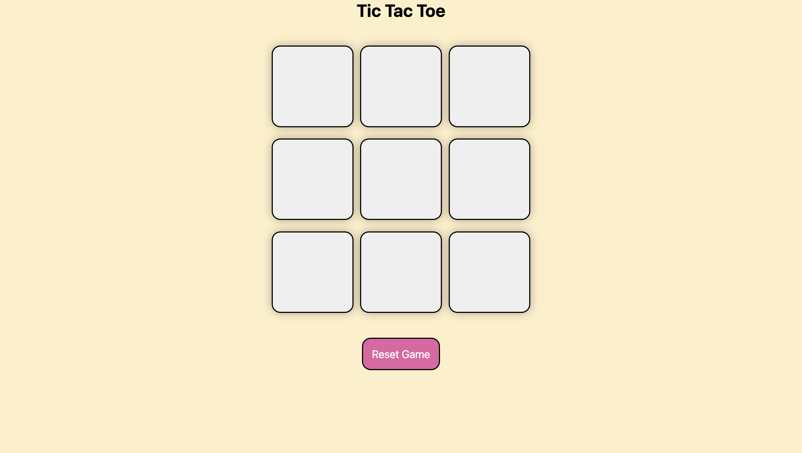
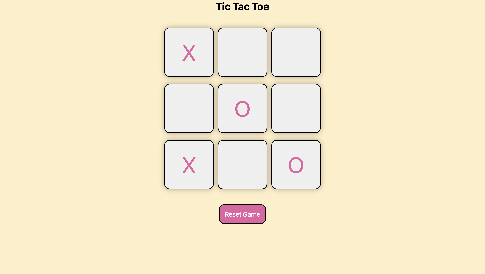
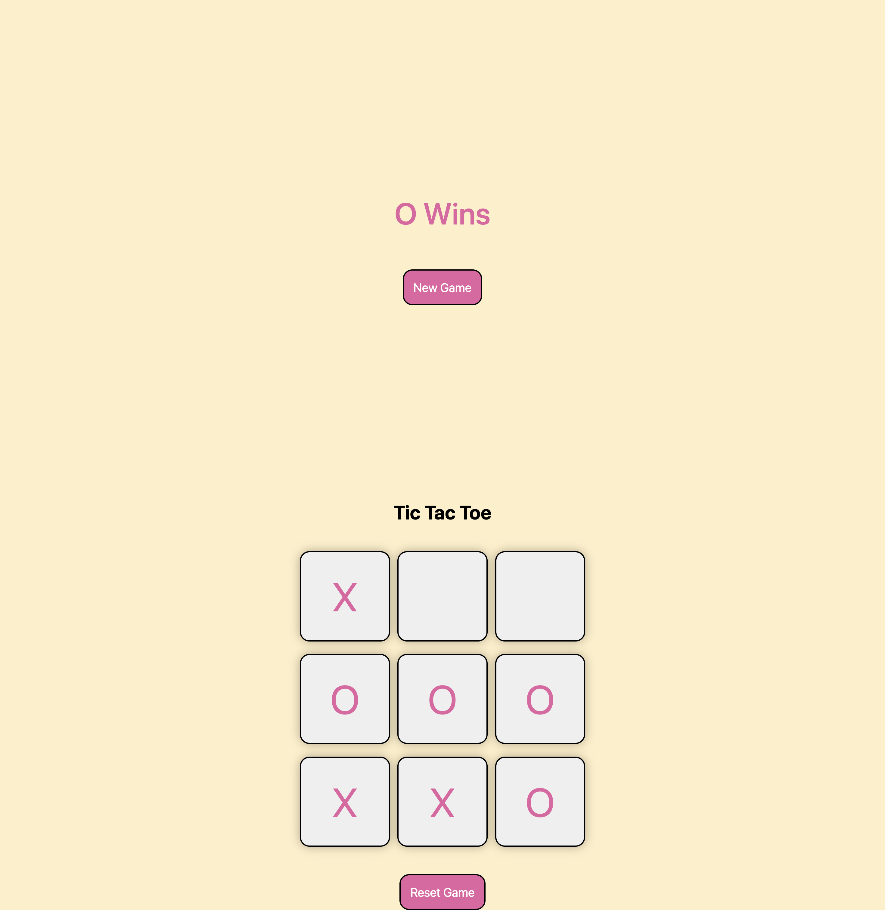
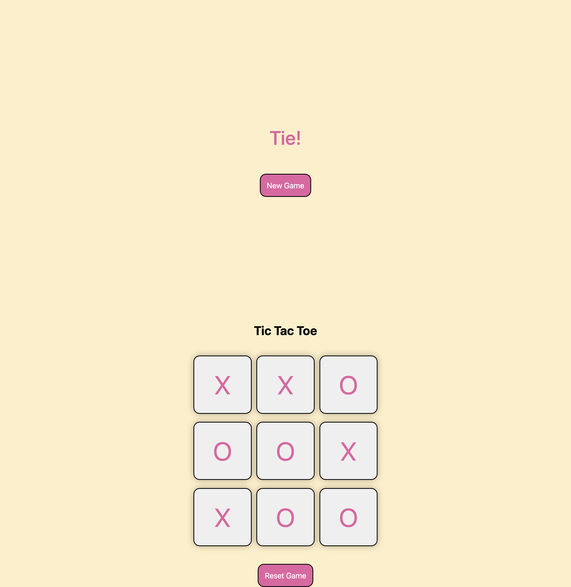

# TicTacToe
Created a browser-based Tic-Tac-Toe game using HTML, CSS, and JavaScript with Document Object Model for boxes, enabling user interaction and dynamic game updates, including win, tie detection, and game reset functionality.

What the project looks like

playing the game

When a player wins

When players tie

